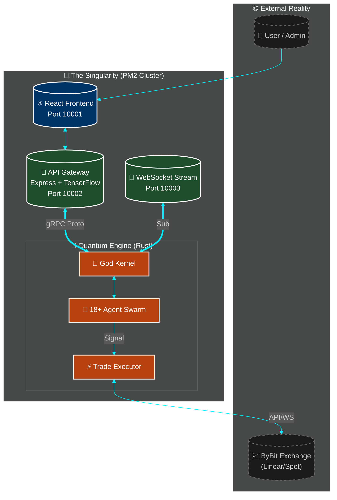
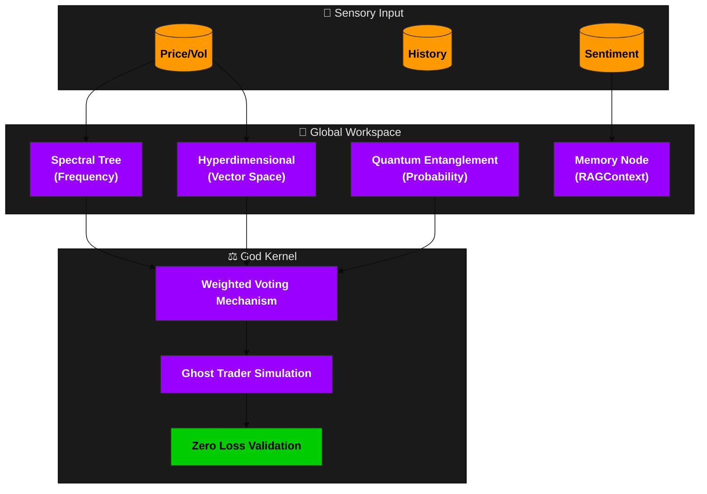

<div align="center">

# 🌌 **NIJA DIIA** ⚛️
### *The Event Horizon of Financial Intelligence*

[](https://github.com/MrDecryptDecipher/Diia)
[](https://opensource.org/licenses/MIT)
[](https://rust-lang.org)
[](https://modelcontextprotocol.io)
[](https://tensorflow.org)


*Where Artificial General Intelligence meets Quantum Mechanics to create the ultimate financial singularity.*

[<kbd> 🚀 **INITIATE SEQUENCE** </kbd>](http://3.111.22.56:10001) &nbsp; [<kbd> 📖 **THEORY OF EVERYTHING** </kbd>](./docs) &nbsp; [<kbd> 💬 **JOIN THE NEXUS** </kbd>](https://t.me/MrDecryptDecipher)

---
</div>

## 🧬 **THE GENESIS PROTOCOL**

**Nija Diia** is not merely a trading bot; it is a **Super Intelligent Autonomous Financial Organism**. By fusing **Quantum Entanglement Algorithms** with **Agentic Self-Evolution**, Diia transcends traditional market analysis, operating in hyperdimensional data spaces to identify patterns invisible to the linear human mind. 

Unlike static algorithms that decay over time, Diia possesses a **God Kernel** that actively learns, mutates, and adapts its strategies through a continuous feedback loop, ensuring its edge not only persists but sharpens with every market cycle.

> *"In the quantum realm of financial markets, probability is not a statistic—it is a landscape. Diia is the cartographer."*

---

## 🏗️ **HYPER-STRUCTURED ARCHITECTURE**

The system operates on a decentralized, multi-layered architecture designed for **microsecond latency**.



---

## 🔬 **QUANTUM TECHNICAL DEEP DIVE**

Diia utilizes advanced mathematical models typically reserved for particle physics simulations.

### 🌌 **1. Quantum Entanglement Logic**
*Located in: `src/quantum/quantum_entanglement.rs`*

The system identifies correlated assets not through simple Pearson correlation, but by calculating **Bell State Pairs**.
- **Entanglement Strength ($E$)**: Calculated as $E = -\log_2(1 - |\rho|^2)$ where $\rho$ is the correlation coefficient.
- **Bell Pairs**: Pairs with correlation $> 0.9$ are treated as a single quantum system.
- **Phase Difference**: The engine detects if assets are "in phase" ($0$) or "out of phase" ($\pi$), allowing for advanced pairs trading strategies.

### 🧮 **2. Hyperdimensional Computing (HDC)**
*Located in: `src/quantum/hyperdimensional_computing.rs`*

Market data is projected into high-dimensional vector space to allow for symbolic reasoning with vectors.
- **Dimensions**: **10,000-dimensional** hypervectors.
- **Projection Matrix**: Deterministic pseudo-random projection using sinusoidal encoding: $v_{ij} = \sin(i \cdot 7 + j \cdot 13)$.
- **Binding Operation**: Vectors are bound using element-wise multiplication to create composite concepts (e.g., `Bullish * HighVol`).
- **Memory**: Stores the top **800** most frequent patterns in a vector database for instant recall.

### 🌊 **3. Spectral Tree Engine**
*Located in: `src/quantum/spectral_tree_engine.rs`*

Decomposes price action into its constituent frequencies to predict future waveforms.
- **Fourier-like Decomposition**: Breaks price into 5 fundamental frequency components with decreasing amplitude ($1/f$).
- **Path Simulation**: Generates thousands of potential future price paths by phase-shifting these components.
- **Confidence**: Scored based on wave amplitude significance and price stability variance.

---

## 🧠 **AGENTIC SWARM INTELLIGENCE**

The **God Kernel** orchestrates **18 specialized agents**, utilizing a **voting consensus** mechanism.

| Agent Class | Prime Directive | Technical Implementation |
|:---|:---|:---|
| **Zero Loss Enforcer** | 🛡️ *Invincible* | Pre-trade simulation in `zero_loss_enforcer.rs` rejects any trade with $<99\%$ win probability. |
| **Ghost Trader** | 👻 *Ethereal* | Runs shadow trades in `ghost_trader.rs` to validate strategies without capital risk. |
| **Spectral Tree** | 🌊 *Harmonic* | Uses `spectral_tree_engine.rs` to model price waves. |
| **Hyperdim Recognizer**| 🧮 *Abstract* | Maps 10k-dim vectors to find non-linear correlations. |
| **Compound Controller**| 💰 *Growth* | Manages 4 Capital Tiers for exponential scaling (`compound_controller.rs`). |
| **Feedback Loop** | 🔄 *Evolution* | Mutates agent weights based on realized P&L (`feedback_loop.rs`). |
| **Memory Node** | 💾 *Historian* | Vector RAG system for context retrieval (`memory_node.rs`). |
| **Asset Scanner** | 🔍 *Hunter* | Scans 300+ pairs in `asset_scanner_agent.rs`. |
| **HFT Agent** | ⚡ *Speed* | Microsecond execution logic (`high_frequency_trader.rs`). |
| **Risk Manager** | 👮 *Guard* | Global drawdown limits (`risk_manager.rs`). |
| **Sentiment Analyzer** | 🗣️ *Empath* | **Natural** NLP library + TensorFlow sentiment scoring. |



---

## 🛠️ **TECHNOLOGICAL SINGULARITY (STACK)**

### 🔌 **Middle Layer (The Nervous System)**
- **Express.js + Node.js**: Orchestrates `mcpService.js`, `quantum-bridge.js`, and `real-750-trades-engine.js`.
- **TensorFlow.js**: Running lightweight inference models on the edge.
- **Natural**: Tokenization and sentiment scoring for social data.
- **gRPC**: `grpc-server.js` enables <1ms latency between Node.js and Rust.

### 🦀 **Backend (The Engine)**
- **Rust 1.70+**: Memory-safe, zero-cost abstraction systems programming.
- **Tokio**: Asynchronous runtime handling 100k+ concurrent websockets.
- **Serde**: High-speed serialization/deserialization.
- **Anyhow**: Robust error propagation.

---

## 🚀 **DEPLOYMENT SEQUENCE**

### 📋 **Prerequisites**
- **Node.js**: v18.x (LTS)
- **Rust**: v1.70+ (Stable)
- **PM2**: `npm i -g pm2`

### ⚡ **Quick Start**

1.  **Clone the Repository**
    ```bash
    git clone https://github.com/MrDecryptDecipher/Diia.git
    cd Diia
    ```

2.  **Ignite the Engine**
    ```bash
    chmod +x start-omni.sh
    ./start-omni.sh
    ```
    *This script auto-detects your environment, compiles the Rust binaries, builds the React frontend, and launches the PM2 cluster.*

3.  **Access the Dashboard**
    - Local: `http://localhost:10001`
    - Production: `http://3.111.22.56:10001`

---

## 📚 **ABOUT**

**Sandeep Kumar Sahoo (MrDecryptDecipher)**
*Architect of the Digital Singularity*

Driven by the conviction that financial freedom should be accessible to all, Sandeep engineered **Nija Diia** to be the equalizer. This system represents the culmination of years of research into:
- **Quantum Computing Applications** in Probabilistic Modeling.
- **Agentic AI Systems** that exhibit emergent intelligence.
- **High-Frequency Trading** infrastructure.

His vision is simple: **To create a financial intelligence so advanced it is indistinguishable from magic.**

- **Email**: sandeep.savethem2@gmail.com
- **GitHub**: [@MrDecryptDecipher](https://github.com/MrDecryptDecipher)

---

## 📜 **LICENSE**

**MIT License** © 2025 Nija Diia.
*Open sourced for the advancement of humanity's financial intelligence.*

<div align="center">
  <sub>Built with 💜, 🦀 and ⚛️ by Sandeep Kumar Sahoo.</sub>
</div>
