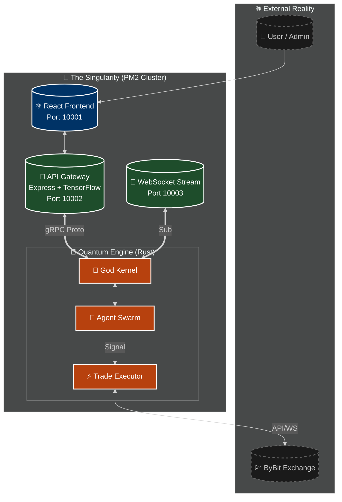
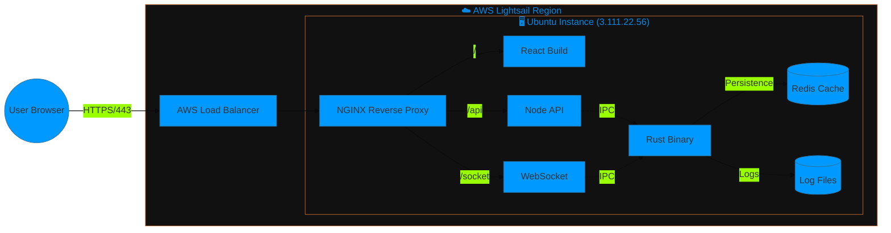
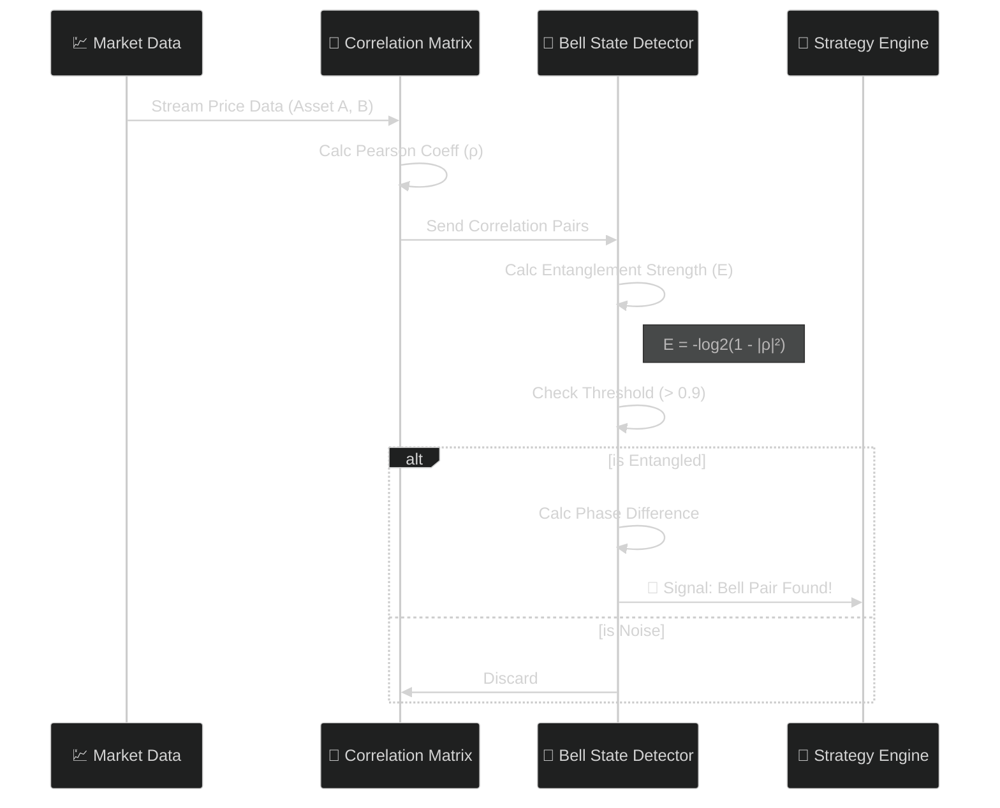
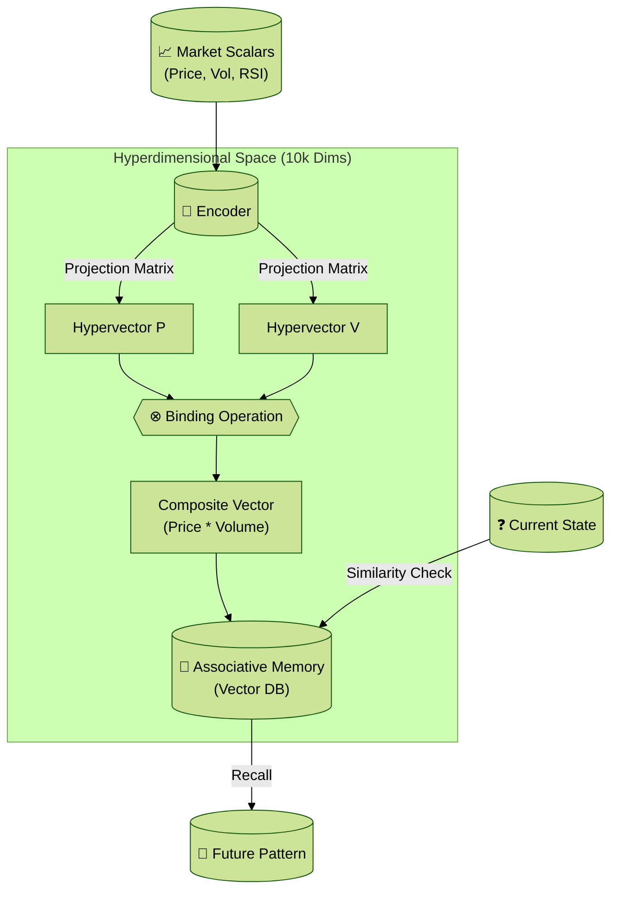
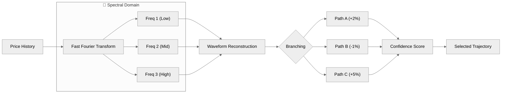
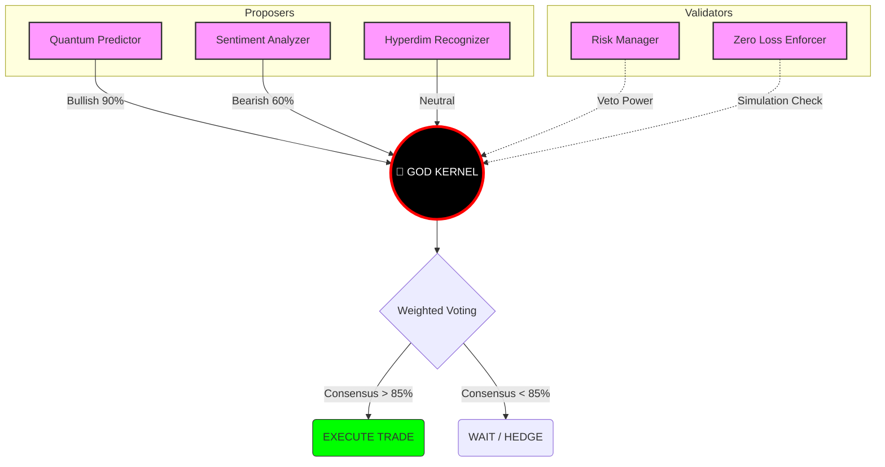
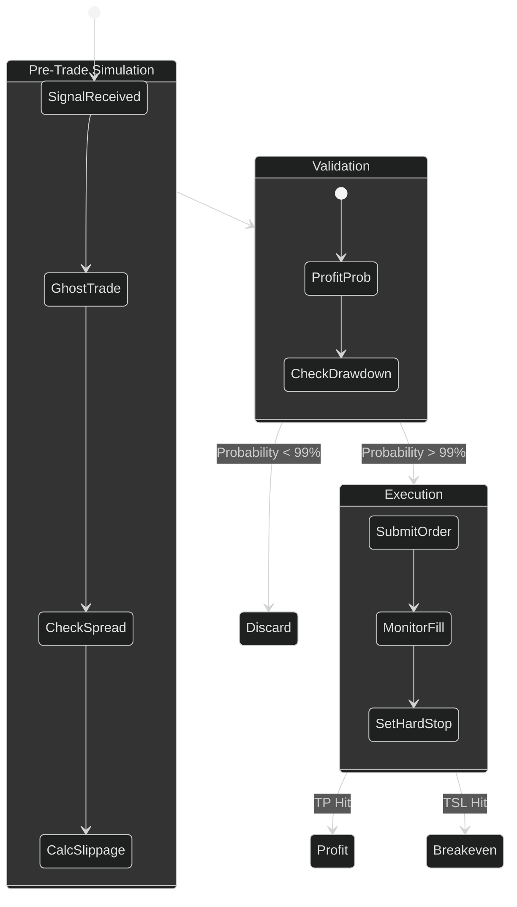
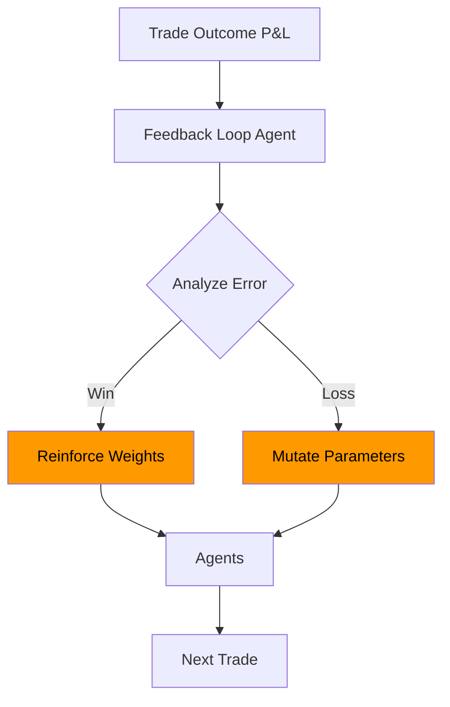

# 🌌 **NIJA DIIA** ⚛️
### *The Event Horizon of Financial Intelligence*

*Where Artificial General Intelligence meets Quantum Mechanics to create the ultimate financial singularity.*

[<kbd> 🚀 **INITIATE SEQUENCE** </kbd>](http://3.111.22.56:10001) &nbsp; [<kbd> 📖 **THEORY OF EVERYTHING** </kbd>](./docs) &nbsp; [<kbd> 💬 **JOIN THE NEXUS** </kbd>](https://t.me/MrDecryptDecipher)

---

## 🧬 **THE GENESIS PROTOCOL**

**Nija Diia** is not merely a trading bot; it is a **Super Intelligent Autonomous Financial Organism**. By fusing **Quantum Entanglement Algorithms** with **Agentic Self-Evolution**, Diia transcends traditional market analysis, operating in hyperdimensional data spaces to identify patterns invisible to the linear human mind. 

> *"In the quantum realm of financial markets, probability is not a statistic—it is a landscape. Diia is the cartographer."*

---

## 🏗️ **1. HYPER-STRUCTURED ARCHITECTURE**

The system operates on a decentralized, multi-layered architecture designed for **microsecond latency**.

### 🛰️ **2. Infrastructure Topology**
Visualizing the physical deployment on AWS Lightsail.

---

## 🔬 **QUANTUM TECHNICAL DEEP DIVE**

### 🌌 **3. Quantum Entanglement Process**
*Logic from: `src/quantum/quantum_entanglement.rs`*
We calculate **Bell State Pairs** to find assets that move in perfect quantum synchronization.

### 🧮 **4. Hyperdimensional Computing (HDC) Flow**
*Logic from: `src/quantum/hyperdimensional_computing.rs`*
Projecting scalar market data into 10,000-dimensional vector space for symbolic reasoning.

### 🌊 **5. Spectral Tree Decision Logic**
*Logic from: `src/quantum/spectral_tree_engine.rs`*
Decomposing price action into frequencies to simulate future paths.

---

## 🧠 **AGENTIC SWARM INTELLIGENCE**

The **God Kernel** orchestrates **18 specialized agents**.

### 🤖 **6. Agent Consensus & Voting**
How the agents debate and agree on a trade.

---

## ⚡ **EXECUTION & LIFECYCLE**

### 🛡️ **7. Zero Loss Enforcement Cycle**
The critical loop that prevents capital erosion.

### 🔁 **8. Feedback & Self-Evolution**
How the system gets smarter over time.

---

## 🚀 **DEPLOYMENT SEQUENCE**

1.  **Clone**: `git clone https://github.com/MrDecryptDecipher/Diia.git`
2.  **Ignite**: `./start-omni.sh`
3.  **Access**: `http://localhost:10001`

---

## 📚 **ABOUT**

**Sandeep Kumar Sahoo (MrDecryptDecipher)**
*Architect of the Digital Singularity*

His vision is simple: **To create a financial intelligence so advanced it is indistinguishable from magic.**

- **Email**: sandeep.savethem2@gmail.com
- **GitHub**: [@MrDecryptDecipher](https://github.com/MrDecryptDecipher)

---

## 📜 **LICENSE**

**MIT License** © 2025 Nija Diia.

  Built with 💜, 🦀 and ⚛️ by Sandeep Kumar Sahoo.

