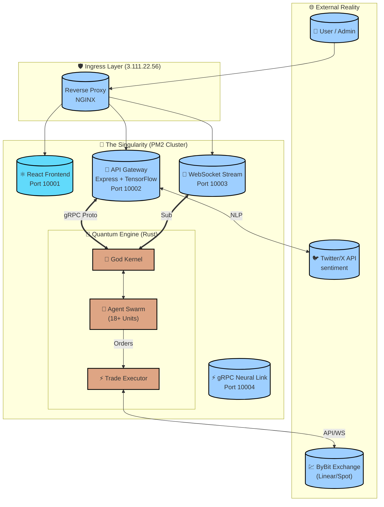
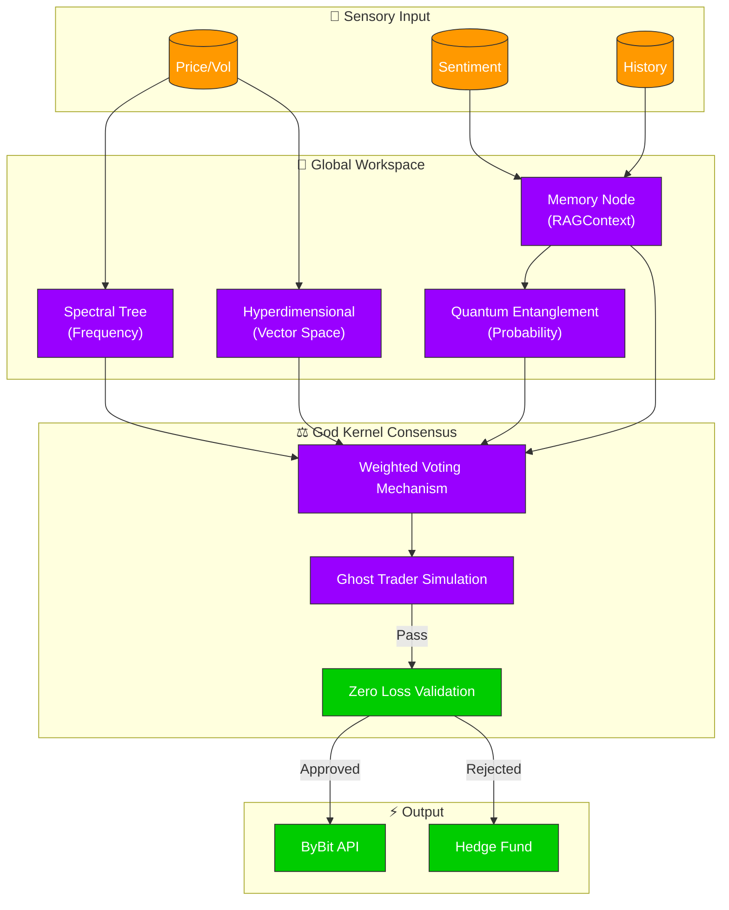

<div align="center">

# 🌌 **NIJA DIIA** ⚛️
### *The Event Horizon of Financial Intelligence*

[](https://github.com/MrDecryptDecipher/Diia)
[](https://opensource.org/licenses/MIT)
[](https://rust-lang.org)
[](https://modelcontextprotocol.io)
[](https://tensorflow.org)


*Where Artificial General Intelligence meets Quantum Mechanics to create the ultimate financial singularity.*

[<kbd> 🚀 **INITIATE SEQUENCE** </kbd>](http://3.111.22.56:10001) &nbsp; [<kbd> 📖 **THEORY OF EVERYTHING** </kbd>](./docs) &nbsp; [<kbd> 💬 **JOIN THE NEXUS** </kbd>](https://t.me/MrDecryptDecipher)

---
</div>

## 🧬 **THE GENESIS PROTOCOL**

**Nija Diia** is not merely a trading bot; it is a **Super Intelligent Autonomous Financial Organism**. By fusing **Quantum Entanglement Algorithms** with **Agentic Self-Evolution**, Diia transcends traditional market analysis, operating in hyperdimensional data spaces to identify patterns invisible to the linear human mind. 

Unlike static algorithms that decay over time, Diia possesses a **God Kernel** that actively learns, mutates, and adapts its strategies through a continuous feedback loop, ensuring its edge not only persists but sharpens with every market cycle.

> *"In the quantum realm of financial markets, probability is not a statistic—it is a landscape. Diia is the cartographer."*

---

## 🏗️ **HYPER-STRUCTURED ARCHITECTURE**

The system operates on a decentralized, multi-layered architecture designed for **microsecond latency** and **infinite horizontal scaling**. It orchestrates a symphony of technologies: **Rust** for raw compute, **Node.js** for flexible orchestration, and **TensorFlow** for neural adaptation.

### 🌐 **System Topology**



---

## 🧠 **AGENTIC SWARM INTELLIGENCE**

The "brain" of Diia is composed of **18+ specialized autonomous agents**, each an expert in a specific domain. They operate in a **Retrievable Augmented Generation (RAG)** loop, constantly arguing, voting, and refining the consensus action under the supervision of the **God Kernel**.

### 🌌 **The 18 Pillars of Intelligence**

| Agent ID | Classification | Prime Directive |
|:---|:---|:---|
| **God Kernel** | 🧠 *Omniscient* | Orchestrates the swarm, resolves conflicts, and evolves strategy weights. |
| **Zero Loss Enforcer** | 🛡️ *Invincible* | Mathematically enforces non-negative P&L via pre-trade simulation and harsh stops. |
| **Ghost Trader** | 👻 *Ethereal* | Runs thousands of "phantom" trades in parallel timelines to validate strategies before funding. |
| **Quantum Predictor** | 🔮 *Oracular* | Uses **entanglement algorithms** to predict price collapse/surges before they happen. |
| **Spectral Tree** | 🌊 *Harmonic* | Decomposes market noise into pure frequencies to find the "music" of the market. |
| **Hyperdim Recognizer**| 🧮 *Abstract* | Maps market data into 11-dimensional vector space to find non-linear correlations. |
| **Anti-Loss Hedger** | ⚖️ *Balance* | Automatically opens counter-positions to delta-neutralize risk during volatility. |
| **Compound Controller**| 💰 *Growth* | Manages capital allocation tiers (Tier 1-4) for exponential compounding. |
| **Sentiment Analyzer** | 🗣️ *Empath* | Natural Language Processing (Natural/TensorFlow) on Twitter & News. |
| **Feedback Loop** | 🔄 *Evolution* | Analyzes past trades to "mutate" the parameters of other agents. |
| **Memory Node** | 💾 *Historian* | Vector database storing all market contexts for RAG-based decision making. |
| **Asset Scanner** | 🔍 *Hunter* | Scans 300+ pairs continuously for setup validation. |
| **HFT Agent** | ⚡ *Speed* | Microsecond execution logic for arbitrage and scalp opportunities. |
| **Risk Manager** | 👮 *Guard* | Global risk parameter enforcement (Max Drawdown, Leverage Limits). |
| *And more...* | | *Agent Coordinator, Market Analyzer, Trade Executor, Main Controller...* |

### 🧬 **Neural Decision Matrix**



---

## 🛠️ **TECHNOLOGICAL SINGULARITY (STACK)**

### 🎨 **Frontend (The Visor)**
- **React 18.2.0**: Concurrent rendering engine.
- **Material-UI (MUI)**: Customized "Quantum Dark" theme system.
- **Data Visualization**: D3.js + Lightweight Charts (TradingView) for financial rendering; Three.js for 3D data exploration.
- **State Management**: Redux Toolkit for atomic state updates.

### 🔌 **Middle Layer (The Nervous System)**
- **Express.js + Node.js**: High-throughput non-blocking I/O.
- **TensorFlow.js**: Running lightweight inference models on the edge.
- **Natural**: Tokenization and sentiment scoring for social data.
- **gRPC**: Protobuf-based communication for <1ms overhead interactions with Rust.

### 🦀 **Backend (The Engine)**
- **Rust 1.70+**: Memory-safe, zero-cost abstraction systems programming.
- **Tokio**: Asynchronous runtime for handling 100k+ concurrent websockets.
- **Serde**: High-speed serialization/deserialization.
- **Anyhow**: Robust error propagation (because silence is deadly).

---

## 🚀 **DEPLOYMENT SEQUENCE**

### 📋 **Prerequisites**
- **Node.js**: v18.x (LTS)
- **Rust**: v1.70+ (Stable)
- **PM2**: `npm i -g pm2`

### ⚡ **Quick Start**

1.  **Clone the Repository**
    ```bash
    git clone https://github.com/MrDecryptDecipher/Diia.git
    cd Diia
    ```

2.  **Ignite the Engine**
    ```bash
    chmod +x start-omni.sh
    ./start-omni.sh
    ```
    *This script auto-detects your environment, compiles the Rust binaries, builds the React frontend, and launches the PM2 cluster.*

3.  **Access the Dashboard**
    - Local: `http://localhost:10001`
    - Production: `http://3.111.22.56:10001`
    - API Health: `http://localhost:10002/health`

---

## 📚 **ABOUT**

**Sandeep Kumar Sahoo (MrDecryptDecipher)**
*Architect of the Digital Singularity*

Driven by the conviction that financial freedom should be accessible to all, Sandeep engineered **Nija Diia** to be the equalizer. This system represents the culmination of years of research into:
- **Quantum Computing Applications** in Probabilistic Modeling.
- **Agentic AI Systems** that exhibit emergent intelligence.
- **High-Frequency Trading** infrastructure.

His vision is simple: **To create a financial intelligence so advanced it is indistinguishable from magic.**

- **Email**: sandeep.savethem2@gmail.com
- **GitHub**: [@MrDecryptDecipher](https://github.com/MrDecryptDecipher)

---

## 📜 **LICENSE**

**MIT License** © 2025 Nija Diia.
*Open sourced for the advancement of humanity's financial intelligence.*

<div align="center">
  <sub>Built with 💜, 🦀 and ⚛️ by the Omni Team.</sub>
</div>
